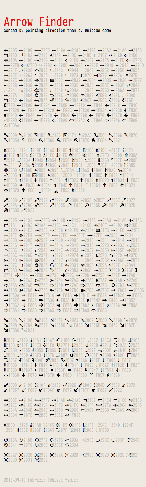

# arrow-finder
These docs help you to find the arrows you need more quickly: 

- You can read the Unicode number near the arrow
- You can copy and paste the arrow where you want

Using [PragmataPro](http://www.fsd.it/fonts/pragmatapro.htm) since v_0.822 you can see this:

  
Enjoy!
